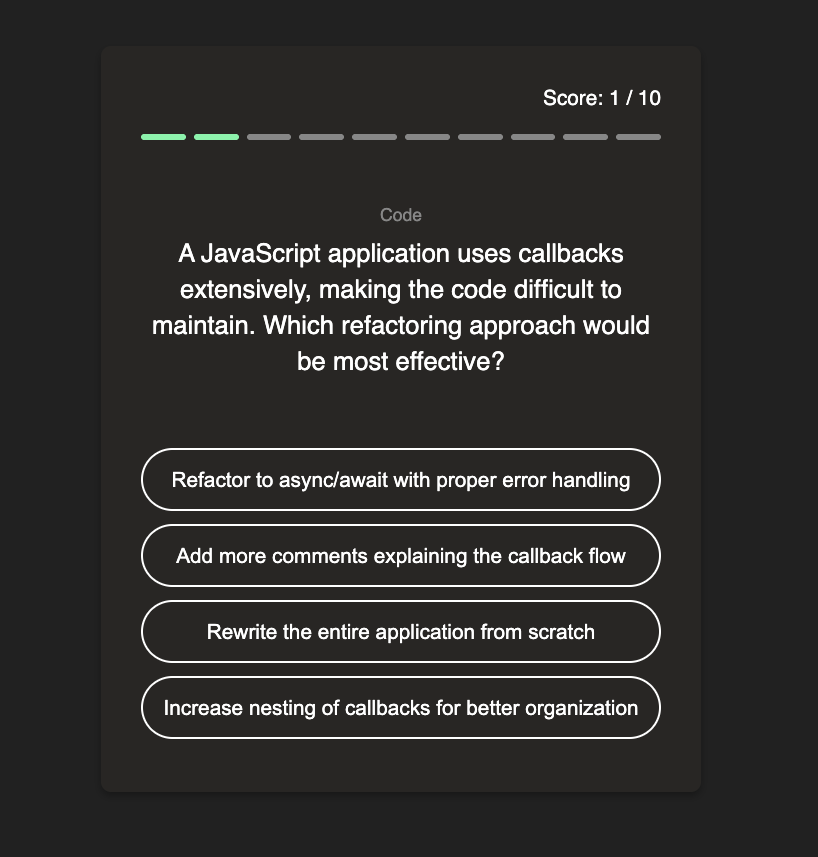
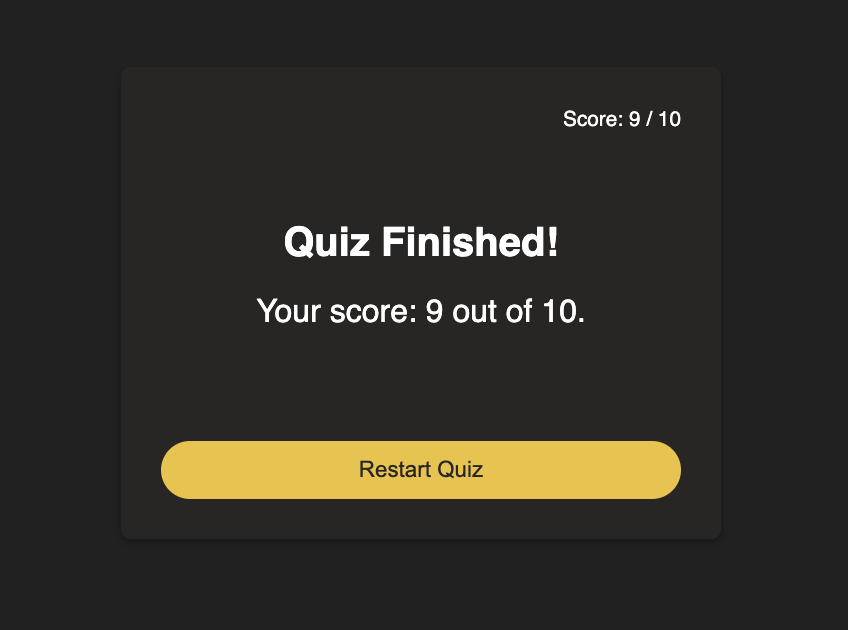

# Coding Quiz App

A simple yet engaging web-based quiz application built with HTML, CSS, and JavaScript. This app fetches programming-related questions from an external API, provides instant feedback on answers, tracks scores, and is fully responsive for various screen sizes.

## Features

* **API Integration:** Dynamically loads coding questions from the [QuizAPI](https://quizapi.io/).
* **Interactive Quiz:** Presents questions with multiple-choice answers.
* **Instant Feedback:** Highlights correct and incorrect answers immediately after selection.
* **Score Tracking:** Keeps a running tally of correct answers.
* **Quiz Progress Bar:** Visually indicates the user's progress through the quiz.
* **Restart Functionality:** Allows users to restart the quiz and fetch new questions.
* **Responsive Design:** Optimized for a seamless experience on desktops, tablets, and mobile devices.
* **Dynamic Styling:** Includes options for theme switching (e.g., light/dark mode readiness).

## Screenshots

Catch a glimpse of the application in action:

| Question View | Score View |
| :----------: | :---------: |
|  |  |


## Live Demo

Experience the quiz yourself!

[Live Demo Link](link-to-your-live-demo-deployment)


## Technologies Used

* **HTML5:** For the basic structure of the web application.
* **CSS3:** For styling and ensuring a responsive and visually appealing user interface.
* **JavaScript (ES6+):** For handling quiz logic, API calls, DOM manipulation, and interactive elements.
* **QuizAPI:** External API for fetching programming questions.

## Setup and Installation

To get a local copy up and running, follow these simple steps.

### Prerequisites

* A web browser (e.g., Chrome, Firefox)
* A text editor (e.g., VS Code)
* An API Key from [QuizAPI](https://quizapi.io/) (free registration required).

### Installation

1.  **Clone the repository:**
    ```bash
    git clone [https://github.com/YourUsername/YourQuizAppRepo.git](https://github.com/YourUsername/YourQuizAppRepo.git)
    ```
    *(**Note:** Replace `https://github.com/YourUsername/YourQuizAppRepo.git` with the actual URL of your GitHub repository.)*
2.  **Navigate to the project directory:**
    ```bash
    cd YourQuizAppRepo
    ```
3.  **Open `index.html`:**
    Simply open the `index.html` file in your web browser.
4.  **Add your QuizAPI Key:**
    Open `app.js` and locate the line:
    ```javascript
    const QUIZAPI_KEY = "YOUR_QUIZAPI_KEY";
    ```
    Replace `"YOUR_QUIZAPI_KEY"` with the actual API key you obtained from QuizAPI.

The application should now be running in your browser!

## Usage

1.  Open the `index.html` file in your browser.
2.  The quiz will load questions automatically from the API.
3.  Click on an answer button to select your choice.
4.  The app will highlight if your answer was correct or wrong.
5.  Proceed through the questions until the quiz is finished.
6.  Your final score will be displayed.
7.  Click the "Restart Quiz" button to play again with new questions.

## Contributing

Contributions are what make the open-source community such an amazing place to learn, inspire, and create. Any contributions you make are **greatly appreciated**.

If you have a suggestion that would make this better, please fork the repo and create a pull request. You can also simply open an issue with the tag "enhancement".
Don't forget to give the project a star! Thanks again!

1.  Fork the Project
2.  Create your Feature Branch (`git checkout -b feature/AmazingFeature`)
3.  Commit your Changes (`git commit -m 'Add some AmazingFeature'`)
4.  Push to the Branch (`git push origin feature/AmazingFeature`)
5.  Open a Pull Request
